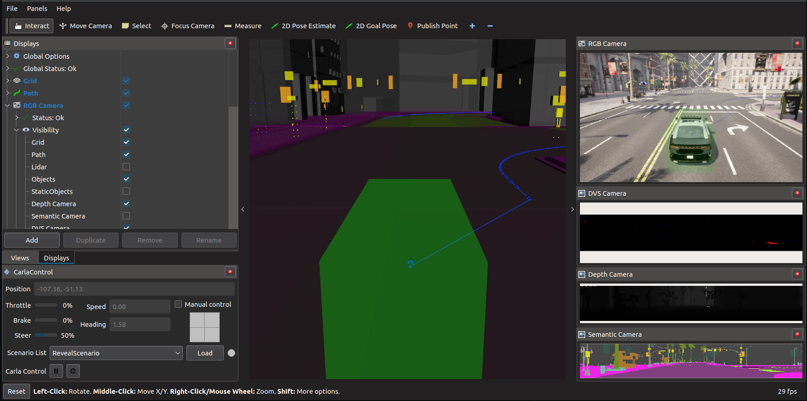

# ROS2 bridge for CARLA simulator v0.9.15

[](https://github.com/carla-simulator/ros-bridge)
[](http://carla.readthedocs.io)
[](https://github.com/carla-simulator/ros-bridge/blob/master/LICENSE)
[](https://github.com/carla-simulator/ros-bridge/releases/latest)

This ROS package is a modified fork of the [carla-simulator/ros-bridge](https://github.com/carla-simulator/ros-bridge) package that is adopted to work with ROS2 Humble running on Ubuntu 22.04 LTS with Scenario Runner v0.9.15. The ROS bridge enables two-way communication between ROS and CARLA. The information from the CARLA server is translated to ROS topics. In the same way, the messages sent between nodes in ROS get translated to commands to be applied in CARLA.

## Main Requirements

- OS: Ubuntu 22.04 LTS
- CARLA Version: 0.9.15
- Scenario Runner Version: 0.9.15
- ROS Version: Humble
- **NOTE**: All testing were peformed using Python 3.10. The default CARLA PythonAPI only supports Python 2.7 and 3.7 (and 3.8 by extension). Updated `.whl` and `.egg` files for Python 3.10 can be found at [https://github.com/gezp/carla_ros/releases/](https://github.com/gezp/carla_ros/releases/).

### Screenshot of Carla AD Demo in Action 



## Instructions (adapted from [ROS Bridge Documentation](https://carla.readthedocs.io/projects/ros-bridge/en/latest/ros_installation_ros2/))
1. Set up a project directory and clone the ROS bridge repository and submodules:
```
mkdir -p ~/Workspace/ros-bridge && cd ~/Workspace/ros-bridge
git clone --recurse-submodules https://github.com/ttgamage/carla-ros-bridge.git
mv carla-ros-bridge src
```
2. Set up ROS environment and install dependencies:
```
source /opt/ros/humble/setup.bash
rosdep update
rosdep install --from-paths src --ignore-src -r
```
3. Build the ROS bridge workspace using colcon:
```
colcon build --symlink-install
```


